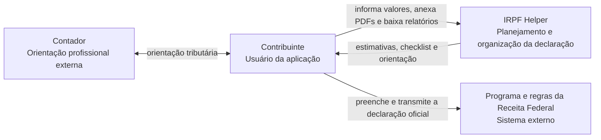
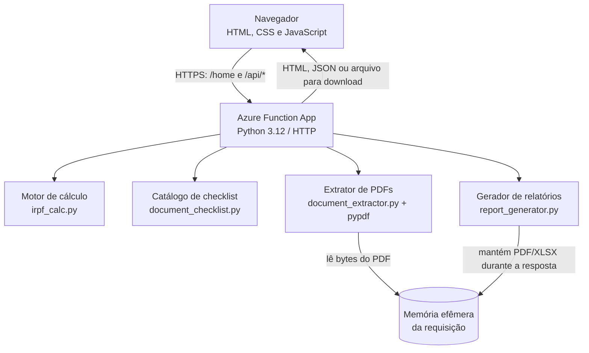
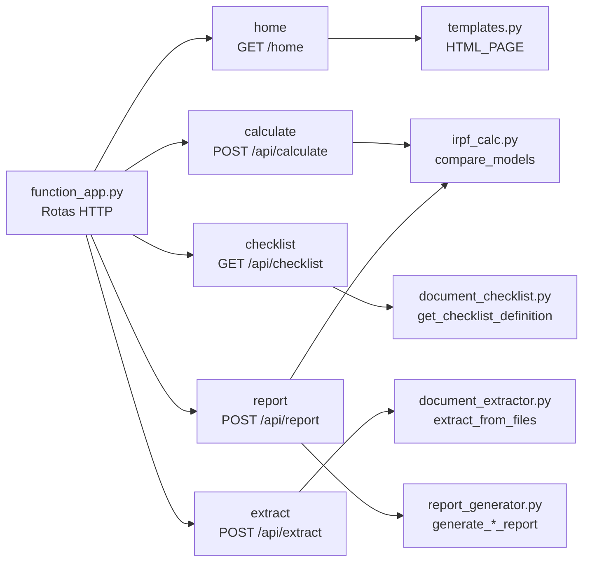
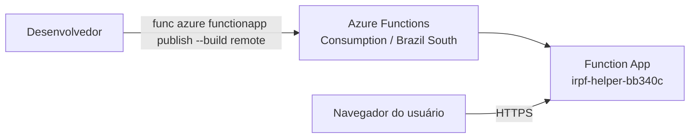

# Arquitetura — modelo C4

Este documento descreve a arquitetura existente, não uma arquitetura-alvo. O IRPF Helper é uma aplicação web monolítica hospedada como Azure Function App. Não há banco de dados, fila, armazenamento de arquivos ou agente de IA em execução.

## Nível 1 — Contexto do sistema

O IRPF Helper apoia o planejamento. Ele não transmite declarações, não autentica no Gov.br/Receita e não consulta sistemas externos.

## Nível 2 — Contêineres

| Contêiner | Tecnologia | Responsabilidade |
| --- | --- | --- |
| Cliente web | HTML, CSS e JavaScript em `templates.py` | Entrada dos dados, apresentação, confirmação de sugestões e download. |
| API | Azure Functions Python em `function_app.py` | Expõe as rotas HTTP, interpreta as requisições e compõe os módulos. |
| Cálculo | Python puro em `irpf_calc.py` | Compara modelos simplificado e completo. |
| Extração | `pypdf` e expressões regulares | Lê PDFs com texto nativo e reconhece alguns valores. |
| Relatórios | ReportLab e openpyxl | Produz PDF e Excel em memória. |

## Nível 3 — Componentes da Function App

### Responsabilidades e fronteiras

- `function_app.py` é a fronteira HTTP: faz parsing e validação básica, mas não contém regras tributárias ou lógica de extração.
- `irpf_calc.py` é determinístico e não possui I/O; por isso é diretamente testável.
- `document_extractor.py` trata o PDF como entrada não confiável e retorna sugestões, nunca altera valores persistidos.
- `report_generator.py` recebe o cálculo pronto e um estado de checklist; não recalcula regras próprias.
- Não existe persistência de estado no servidor. O estado da interface reside no navegador durante a sessão.

## Infraestrutura e implantação

O runtime e o nome da Function App atual estão documentados no [README principal](../README.md#deploy-no-azure). O modelo não pressupõe recursos adicionais do Azure.
