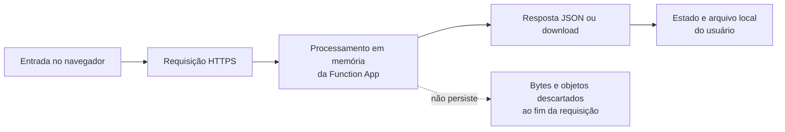

# Dados, privacidade e ciclo de vida

## Inventário de dados

| Categoria | Exemplos | Classificação | Origem | Uso |
| --- | --- | --- | --- | --- |
| Dados financeiros | salário, INSS, deduções, pensão, rendimentos extras | Sensível/financeiro | Formulário | Estimar e comparar imposto. |
| Dados de dependentes | quantidade de dependentes | Pessoal | Formulário | Calcular dedução anual. |
| Documentos fiscais | informe de rendimentos, recibos e nomes de arquivos | Confidencial | Upload do usuário | Sugerir preenchimento e compor checklist. |
| Resultado | bases de cálculo, imposto estimado, recomendação | Financeiro derivado | Motor de cálculo | Exibir e exportar resumo. |
| Checklist | categoria, marcação e nomes dos arquivos | Pessoal/operacional | Interface | Organizar documentos e relatório. |

## Ciclo de vida

Pelo código atual, não há banco de dados, blob storage, fila ou gravação local de uploads. Os bytes de PDFs são lidos em memória para a requisição de extração e os relatórios também são montados em memória antes da resposta.

## Controles existentes

- Extração acionada explicitamente pelo usuário; anexar um arquivo não inicia o upload por si só.
- Limite de cinco arquivos por requisição e 10 MB por arquivo.
- Sem OCR: documentos escaneados não têm sua imagem interpretada.
- Arquivos protegidos por senha e PDFs ilegíveis retornam erro tratável.
- Sugestões extraídas não são aplicadas sem confirmação do usuário na interface.
- O relatório é retornado como download, sem persistência pelo aplicativo.

## Limites e cuidados operacionais

- “Processamento em memória” não elimina a necessidade de controlar logs, telemetria, dumps de erro e políticas da plataforma Azure. Não registre conteúdo de formulários, PDFs, tokens ou dados fiscais em logs.
- Os dados continuam sujeitos ao transporte e à infraestrutura do provedor de nuvem. Use sempre HTTPS e revise a configuração de observabilidade antes de produção.
- O usuário é responsável por proteger os PDFs e relatórios salvos no seu dispositivo.
- Antes de introduzir persistência, OCR, analytics ou integrações externas, faça uma avaliação de privacidade/LGPD, defina base legal, retenção, controle de acesso e processo de exclusão.

## Retenção atual

| Dado | Retenção pela aplicação |
| --- | --- |
| Corpo do cálculo | Somente durante a requisição. |
| PDF enviado | Somente durante a requisição de extração. |
| Texto extraído | Somente durante a requisição. |
| Relatório gerado | Somente durante a resposta de download. |
| Dados persistidos no servidor | Nenhum, no código atual. |
