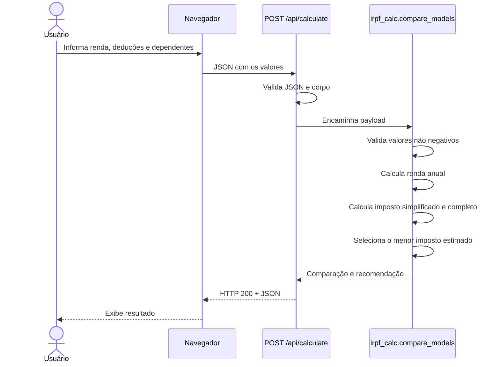
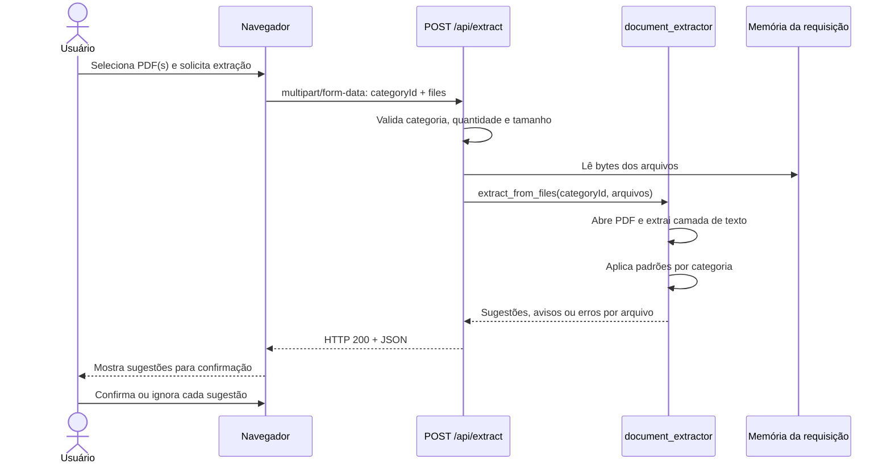
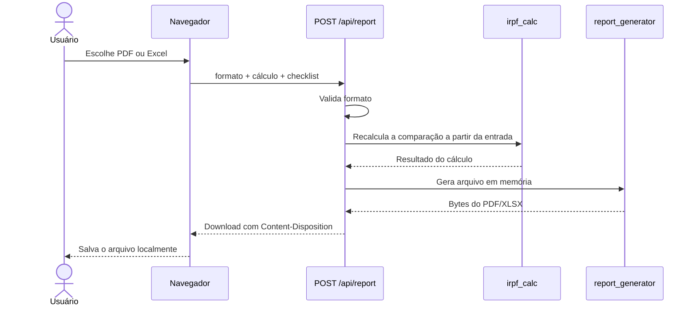

# Fluxos de processo

## 1. Comparação dos modelos de declaração

Regras operacionais:

- `salary` representa a renda bruta mensal e é multiplicado por 12.
- `extraIncome`, `deductions`, `inss` e `pension` são valores anuais.
- entradas negativas ou não numéricas retornam HTTP 400;
- as constantes tributárias são centralizadas em `irpf_calc.py` e estão marcadas como ano-calendário 2024.

## 2. Extração de dados de documentos

Tratamento esperado:

| Situação | Resultado |
| --- | --- |
| Mais de 5 arquivos | HTTP 400. |
| Arquivo acima de 10 MB | HTTP 400. |
| PDF protegido ou corrompido | Resultado do arquivo com `status: error`. |
| PDF escaneado/sem texto | Resultado com `status: no_text`; preenchimento manual. |
| Texto sem padrão reconhecido | Resultado `ok`, sem sugestões. |

O extrator não faz OCR e não garante que um valor reconhecido esteja correto. A confirmação humana é obrigatória no fluxo de interface.

## 3. Geração de relatório

O backend recalcula o resultado em vez de confiar no cálculo apresentado pelo navegador. O relatório contém estimativas e o estado do checklist recebido na requisição.
